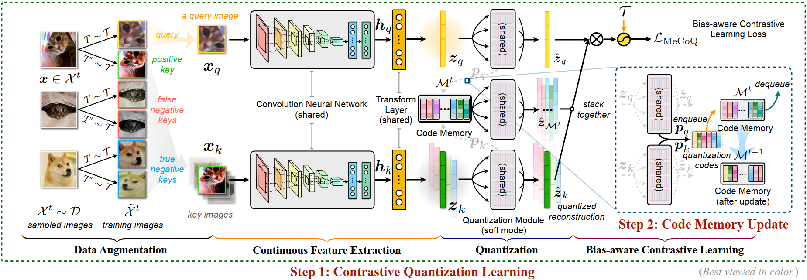

# MeCoQ: Contrastive Quantization with Code Memory for Unsupervised Image Retrieval

[toc]

## 1. Introduction



This repository provides the code for our paper at **AAAI 2022 (<font color='red'>Oral</font>)**:

**Contrastive Quantization with Code Memory for Unsupervised Image Retrieval**. Jinpeng Wang, Ziyun Zeng, Bin Chen, Tao Dai, Shu-Tao Xia. [[arXiv](https://arxiv.org/abs/2109.05205)].

We proposed MeCoQ, an unsupervised deep quantization method for image retrieval. Different from reconstruction-based methods that learn to preserve pairwise similarity information in continuous embeddings, MeCoQ learns quantized representation via contrastive learning. To boost contrastive learning, MeCoQ leverages a *quantization code memory* during training. Experiments on CIFAR-10 (under two evaluation protocols), Flickr-25K, and NUS-WIDE datasets demonstrate the effectiveness of MeCoQ.

In the following, we will guide you how to use this repository step by step. 🤗

## 2. Preparation

```bash
git clone https://github.com/gimpong/AAAI22-MeCoQ.git
cd AAAI22-MeCoQ/
```

### 2.1 Requirements

- python 3.7.9
- numpy 1.19.1
- pandas 1.0.5
- pytorch 1.3.1
- torchvision 0.4.2
- pillow 8.0.0
- python-opencv 3.4.2
- tqdm 4.51.0

### 2.2 Download the image datasets and organize them properly

Before running the code, we need to make sure that everything needed is ready. First, the working directory is expected to be organized as below:

<details><summary>AAAI22-MeCoQ/</summary>
<ul>
    <li>data/</li>
    <ul>
    	<li>Flickr25k/</li>
    	<ul>
    		<li>img.txt</li>
    		<li>targets.txt</li>
    	</ul>
    	<li>Nuswide/</li>
    	<ul>
    		<li>database.txt</li>
    		<li>test.txt</li>
    		<li>train.txt</li>
    	</ul>
    </ul>
    <li>datasets/</li>
    <ul>
    	<li>CIFAR-10/</li>
    	<ul>
    		<li>cifar-10-batches-py/</li>
    		<ul>
    			<li>batches.meta</li>
    			<li>data_batch_1</li>
    			<li>...</li>
    		</ul>
    	</ul>
    	<li>Flickr25K/</li>
    	<ul>
    		<li>mirflickr/</li>
    		<ul>
    			<li>im1.jpg</li>
    			<li>im2.jpg</li>
    			<li>...</li>
    		</ul>
    	</ul>
    	<li>NUS-WIDE/</li>
    	<ul>
    		<li>Flickr/</li>
    		<ul>
    			<li>actor/</li>
    			<ul>
    				<li>0001_2124494179.jpg</li>
    				<li>0002_174174086.jpg</li>
    				<li>...</li>
    			</ul>
    			<li>administrative_assistant/</li>
    			<ul>
    				<li>...</li>
    			</ul>
    			<li>...</li>
    		</ul>
    	</ul>
    </ul>
    <li>scripts/</li>
    <ul>
    	<li>run0001.sh</li>
    	<li>run0002.sh</li>
    	<li>...</li>
    </ul>
    <li>main.py</li>
    <li>engine.py</li>
    <li>data.py</li>
    <li>utils.py</li>
    <li>loss.py</li>
</ul>
</details>

#### Notes

- The `data/` folder is the collection of data splits for Flickr25K and NUS-WIDE datasets. The **raw images** of Flickr25K and NUS-WIDE datasets should be downloaded additionally and arranged in `datasets/Flickr25K/` and `datasets/NUS-WIDE/` respectively. Here we provide copies of these image datasets, you can download them via [Google Drive](https://drive.google.com/drive/folders/1lKMr3rFAmsDDWJKW5DU_WXiv7at04vPb?usp=sharing) or [Baidu Wangpan (Web Drive, password: **n307**)](https://pan.baidu.com/s/1tno2iBm_D3mZ661Bha8Vfw).

- For experiments on CIFAR-10 dataset, you can use the option `--download_cifar10` when running `main.py`.

## 3. Train and then evaluate (<font color='red'>'TBD' grids will be updated soon, we are re-runing these experiments</font>)

To facilitate reproducibility, we provide the scripts with configurations for each experiment. These scripts can be found under the scripts/ folder. For example, if you want to train and evaluate a 16-bit MeCoQ model on Flickr25K dataset, you can do

```bash
cd scripts/
# '0' is the id of GPU
bash run0001.sh 0
```

The script `run0001.sh` includes the running commands:

```bash
#!/bin/bash
cd ..
python main.py \
    --notes Flickr16bits \
    --device cuda:$1 \
    --dataset Flickr25K \
    --trainable_layer_num 0 \
    --M 2 \
    --feat_dim 32 \
    --T 0.4 \
    --hp_beta 1e-1 \
    --hp_lambda 0.5 \
    --mode debias --pos_prior 0.15 \
    --queue_begin_epoch 5 \
    --topK 5000
cd -
```

After running a script, a series of folders and files will be saved under `logs/` and `checkpoints/`, whose file identifiers are consistent with the argument `--notes` in `run0001.sh` (e.g., `Flickr16bits`). 

Under `logs/` , there will be a log file (e.g., `Flickr16bits.log`) and a folder of tensorboard files (e.g., `Flickr16bits`). 

Under `checkpoints/`, there will be a folder (e.g., `Flickr16bits/`) of information for the final checkpoint, including quantization codes (`db_codes.npy`) and labels (`db_targets.npy`) for the database set, model checkpoint (`model.cpt`), performance records (`P_at_topK_curve.txt` and `PR_curve.txt`).

#### ⚠️Warning: the difficulty in reproducing exactly the same results on different software and hardware architectures 🤔

Initially, we tuned different experiments (e.g., different datasets and different quantization code lengths) separately on different servers in the authors' lab. These servers are equipped with 3 kinds of GPUs: NVIDIA® GeForce® GTX 1080 Ti (11GB), NVIDIA® GeForce® GTX 2080 Ti (11GB) and NVIDIA® Tesla® V100 (32 GB). 

During our preparation for code releasing, we accidentally found that ***even with the same code and same hyper-parameter configuration (including the fixed random seeds), executing experiments on different servers can still yield different results***. Such results may be influenced by various factors, e.g., the versions of drivers, libraries, and hardware architectures. 

Unfortunately, we were not aware of this phenomenon during our paper submission and the reported results were based on mixed architectures. 😩

Here we report the results of running the scripts on three kinds of GPUs in the following table. We have also uploaded the logs and checkpoint information for reference, which can be downloaded from [Baidu Wangpan (Web Drive), password: **ncw0**](https://pan.baidu.com/s/16T8mlZM_XhYHzrZA22npGg).

<table class="tg">
<thead>
  <tr>
    <th class="tg-0lax" rowspan="2">Script</th>
    <th class="tg-0lax" rowspan="2">Dataset</th>
    <th class="tg-0lax" rowspan="2">Code Length / bit</th>
    <th class="tg-0lax" rowspan="2">Distance Computation</th>
    <th class="tg-0lax" colspan="2">GTX 1080 Ti</th>
    <th class="tg-0lax" colspan="2">GTX 2080 Ti</th>
    <th class="tg-0lax" colspan="2">V100</th>
  </tr>
  <tr>
    <th class="tg-0lax">MAP</th>
    <th class="tg-0lax">log</th>
    <th class="tg-0lax">MAP</th>
    <th class="tg-0lax">log</th>
    <th class="tg-0lax">MAP</th>
    <th class="tg-0lax">log</th>
  </tr>
</thead>
<tbody>
  <tr>
    <td class="tg-0lax"><a href="scripts/run0001.sh">run0001.sh</a></td>
    <td class="tg-0lax" rowspan="6">Flickr25K</td>
    <td class="tg-0lax" rowspan="2">16</td>
    <td class="tg-0lax">Asymmetric</td>
    <td class="tg-0lax">81.3137</td>
    <td class="tg-0lax"><a href="1080Ti_reference_logs/Flickr16bits.log">Flickr16bits.log</a></td>
    <td class="tg-0lax">TBD</td>
    <td class="tg-0lax"><a href="2080Ti_reference_logs/Flickr16bits.log">Flickr16bits.log</a></td>
    <td class="tg-0lax">81.6233</td>
    <td class="tg-0lax"><a href="V100_reference_logs/Flickr16bits.log">Flickr16bits.log</a></td>
  </tr>
  <tr>
    <td class="tg-0lax"><a href="scripts/run0002.sh">run0002.sh</a></td>
    <td class="tg-0lax">Symmetric</td>
    <td class="tg-0lax">79.9250</td>
    <td class="tg-0lax"><a href="1080Ti_reference_logs/Flickr16bitsSymm.log">Flickr16bitsSymm.log</a></td>
    <td class="tg-0lax">TBD</td>
    <td class="tg-0lax"><a href="2080Ti_reference_logs/Flickr16bitsSymm.log">Flickr16bitsSymm.log</a></td>
    <td class="tg-0lax">80.3065</td>
    <td class="tg-0lax"><a href="V100_reference_logs/Flickr16bitsSymm.log">Flickr16bitsSymm.log</a></td>
  </tr>
  <tr>
    <td class="tg-0lax"><a href="scripts/run0003.sh">run0003.sh</a></td>
    <td class="tg-0lax" rowspan="2">32</td>
    <td class="tg-0lax">Asymmetric</td>
    <td class="tg-0lax">82.3116</td>
    <td class="tg-0lax"><a href="1080Ti_reference_logs/Flickr32bits.log">Flickr32bits.log</a></td>
    <td class="tg-0lax">TBD</td>
    <td class="tg-0lax"><a href="2080Ti_reference_logs/Flickr32bits.log">Flickr32bits.log</a></td>
    <td class="tg-0lax">81.0789</td>
    <td class="tg-0lax"><a href="V100_reference_logs/Flickr32bits.log">Flickr32bits.log</a></td>
  </tr>
  <tr>
    <td class="tg-0lax"><a href="scripts/run0004.sh">run0004.sh</a></td>
    <td class="tg-0lax">Symmetric</td>
    <td class="tg-0lax">81.5173</td>
    <td class="tg-0lax"><a href="1080Ti_reference_logs/Flickr32bitsSymm.log">Flickr32bitsSymm.log</a></td>
    <td class="tg-0lax">TBD</td>
    <td class="tg-0lax"><a href="2080Ti_reference_logs/Flickr32bitsSymm.log">Flickr32bitsSymm.log</a></td>
    <td class="tg-0lax">80.4656</td>
    <td class="tg-0lax"><a href="V100_reference_logs/Flickr32bitsSymm.log">Flickr32bitsSymm.log</a></td>
  </tr>
  <tr>
    <td class="tg-0lax"><a href="scripts/run0005.sh">run0005.sh</a></td>
    <td class="tg-0lax" rowspan="2">64</td>
    <td class="tg-0lax">Asymmetric</td>
    <td class="tg-0lax">82.6785</td>
    <td class="tg-0lax"><a href="1080Ti_reference_logs/Flickr64bits.log">Flickr64bits.log</a></td>
    <td class="tg-0lax">TBD</td>
    <td class="tg-0lax"><a href="2080Ti_reference_logs/Flickr64bits.log">Flickr64bits.log</a></td>
    <td class="tg-0lax">78.2403</td>
    <td class="tg-0lax"><a href="V100_reference_logs/Flickr64bits.log">Flickr64bits.log</a></td>
  </tr>
  <tr>
    <td class="tg-0lax"><a href="scripts/run0006.sh">run0006.sh</a></td>
    <td class="tg-0lax">Symmetric</td>
    <td class="tg-0lax">82.2351</td>
    <td class="tg-0lax"><a href="1080Ti_reference_logs/Flickr64bitsSymm.log">Flickr64bitsSymm.log</a></td>
    <td class="tg-0lax">TBD</td>
    <td class="tg-0lax"><a href="2080Ti_reference_logs/Flickr64bitsSymm.log">Flickr64bitsSymm.log</a></td>
    <td class="tg-0lax">77.0577</td>
    <td class="tg-0lax"><a href="V100_reference_logs/Flickr64bitsSymm.log">Flickr64bitsSymm.log</a></td>
  </tr>
  <tr>
    <td class="tg-0lax"><a href="scripts/run0007.sh">run0007.sh</a></td>
    <td class="tg-0lax" rowspan="6">CIFAR-10 (I)</td>
    <td class="tg-0lax" rowspan="2">16</td>
    <td class="tg-0lax">Asymmetric</td>
    <td class="tg-0lax">68.8245</td>
    <td class="tg-0lax"><a href="1080Ti_reference_logs/CifarI16bits.log">CifarI16bits.log</a></td>
    <td class="tg-0lax">TBD</td>
    <td class="tg-0lax"><a href="2080Ti_reference_logs/CifarI16bits.log">CifarI16bits.log</a></td>
    <td class="tg-0lax">69.0129</td>
    <td class="tg-0lax"><a href="V100_reference_logs/CifarI16bits.log">CifarI16bits.log</a></td>
  </tr>
  <tr>
    <td class="tg-0lax"><a href="scripts/run0008.sh">run0008.sh</a></td>
    <td class="tg-0lax">Symmetric</td>
    <td class="tg-0lax">65.9515</td>
    <td class="tg-0lax"><a href="1080Ti_reference_logs/CifarI16bitsSymm.log">CifarI16bitsSymm.log</a></td>
    <td class="tg-0lax">TBD</td>
    <td class="tg-0lax"><a href="2080Ti_reference_logs/CifarI16bitsSymm.log">CifarI16bitsSymm.log</a></td>
    <td class="tg-0lax">66.1888</td>
    <td class="tg-0lax"><a href="V100_reference_logs/CifarI16bitsSymm.log">CifarI16bitsSymm.log</a></td>
  </tr>
  <tr>
    <td class="tg-0lax"><a href="scripts/run0009.sh">run0009.sh</a></td>
    <td class="tg-0lax" rowspan="2">32</td>
    <td class="tg-0lax">Asymmetric</td>
    <td class="tg-0lax">70.2410</td>
    <td class="tg-0lax"><a href="1080Ti_reference_logs/CifarI32bits.log">CifarI32bits.log</a></td>
    <td class="tg-0lax">TBD</td>
    <td class="tg-0lax"><a href="2080Ti_reference_logs/CifarI32bits.log">CifarI32bits.log</a></td>
    <td class="tg-0lax">70.3119</td>
    <td class="tg-0lax"><a href="V100_reference_logs/CifarI32bits.log">CifarI32bits.log</a></td>
  </tr>
  <tr>
    <td class="tg-0lax"><a href="scripts/run0010.sh">run0010.sh</a></td>
    <td class="tg-0lax">Symmetric</td>
    <td class="tg-0lax">69.1810</td>
    <td class="tg-0lax"><a href="1080Ti_reference_logs/CifarI32bitsSymm.log">CifarI32bitsSymm.log</a></td>
    <td class="tg-0lax">TBD</td>
    <td class="tg-0lax"><a href="2080Ti_reference_logs/CifarI32bitsSymm.log">CifarI32bitsSymm.log</a></td>
    <td class="tg-0lax">69.1754</td>
    <td class="tg-0lax"><a href="V100_reference_logs/CifarI32bitsSymm.log">CifarI32bitsSymm.log</a></td>
  </tr>
  <tr>
    <td class="tg-0lax"><a href="scripts/run0011.sh">run0011.sh</a></td>
    <td class="tg-0lax" rowspan="2">64</td>
    <td class="tg-0lax">Asymmetric</td>
    <td class="tg-0lax">70.2445</td>
    <td class="tg-0lax"><a href="1080Ti_reference_logs/CifarI64bits.log">CifarI64bits.log</a></td>
    <td class="tg-0lax">TBD</td>
    <td class="tg-0lax"><a href="2080Ti_reference_logs/CifarI64bits.log">CifarI64bits.log</a></td>
    <td class="tg-0lax">70.2405</td>
    <td class="tg-0lax"><a href="V100_reference_logs/CifarI64bits.log">CifarI64bits.log</a></td>
  </tr>
  <tr>
    <td class="tg-0lax"><a href="scripts/run0012.sh">run0012.sh</a></td>
    <td class="tg-0lax">Symmetric</td>
    <td class="tg-0lax">69.4085</td>
    <td class="tg-0lax"><a href="1080Ti_reference_logs/CifarI64bitsSymm.log">CifarI64bitsSymm.log</a></td>
    <td class="tg-0lax">TBD</td>
    <td class="tg-0lax"><a href="2080Ti_reference_logs/CifarI64bitsSymm.log">CifarI64bitsSymm.log</a></td>
    <td class="tg-0lax">69.3487</td>
    <td class="tg-0lax"><a href="V100_reference_logs/CifarI64bitsSymm.log">CifarI64bitsSymm.log</a></td>
  </tr>
  <tr>
    <td class="tg-0lax"><a href="scripts/run0013.sh">run0013.sh</a></td>
    <td class="tg-0lax" rowspan="6">CIFAR-10 (II)</td>
    <td class="tg-0lax" rowspan="2">16</td>
    <td class="tg-0lax">Asymmetric</td>
    <td class="tg-0lax">62.8279</td>
    <td class="tg-0lax"><a href="1080Ti_reference_logs/CifarII16bits.log">CifarII16bits.log</a></td>
    <td class="tg-0lax">TBD</td>
    <td class="tg-0lax"><a href="2080Ti_reference_logs/CifarII16bits.log">CifarII16bits.log</a></td>
    <td class="tg-0lax">62.5369</td>
    <td class="tg-0lax"><a href="V100_reference_logs/CifarII16bits.log">CifarII16bits.log</a></td>
  </tr>
  <tr>
    <td class="tg-0lax"><a href="scripts/run0014.sh">run0014.sh</a></td>
    <td class="tg-0lax">Symmetric</td>
    <td class="tg-0lax">60.3927</td>
    <td class="tg-0lax"><a href="1080Ti_reference_logs/CifarII16bitsSymm.log">CifarII16bitsSymm.log</a></td>
    <td class="tg-0lax">TBD</td>
    <td class="tg-0lax"><a href="2080Ti_reference_logs/CifarII16bitsSymm.log">CifarII16bitsSymm.log</a></td>
    <td class="tg-0lax">60.0741</td>
    <td class="tg-0lax"><a href="V100_reference_logs/CifarII16bitsSymm.log">CifarII16bitsSymm.log</a></td>
  </tr>
  <tr>
    <td class="tg-0lax"><a href="scripts/run0015.sh">run0015.sh</a></td>
    <td class="tg-0lax" rowspan="2">32</td>
    <td class="tg-0lax">Asymmetric</td>
    <td class="tg-0lax">64.0929</td>
    <td class="tg-0lax"><a href="1080Ti_reference_logs/CifarII32bits.log">CifarII32bits.log</a></td>
    <td class="tg-0lax">TBD</td>
    <td class="tg-0lax"><a href="2080Ti_reference_logs/CifarII32bits.log">CifarII32bits.log</a></td>
    <td class="tg-0lax">63.1728</td>
    <td class="tg-0lax"><a href="V100_reference_logs/CifarII32bits.log">CifarII32bits.log</a></td>
  </tr>
  <tr>
    <td class="tg-0lax"><a href="scripts/run0016.sh">run0016.sh</a></td>
    <td class="tg-0lax">Symmetric</td>
    <td class="tg-0lax">62.1983</td>
    <td class="tg-0lax"><a href="1080Ti_reference_logs/CifarII32bitsSymm.log">CifarII32bitsSymm.log</a></td>
    <td class="tg-0lax">TBD</td>
    <td class="tg-0lax"><a href="2080Ti_reference_logs/CifarII32bitsSymm.log">CifarII32bitsSymm.log</a></td>
    <td class="tg-0lax">61.4763</td>
    <td class="tg-0lax"><a href="V100_reference_logs/CifarII32bitsSymm.log">CifarII32bitsSymm.log</a></td>
  </tr>
  <tr>
    <td class="tg-0lax"><a href="scripts/run0017.sh">run0017.sh</a></td>
    <td class="tg-0lax" rowspan="2">64</td>
    <td class="tg-0lax">Asymmetric</td>
    <td class="tg-0lax">65.0706</td>
    <td class="tg-0lax"><a href="1080Ti_reference_logs/CifarII64bits.log">CifarII64bits.log</a></td>
    <td class="tg-0lax">TBD</td>
    <td class="tg-0lax"><a href="2080Ti_reference_logs/CifarII64bits.log">CifarII64bits.log</a></td>
    <td class="tg-0lax">64.6805</td>
    <td class="tg-0lax"><a href="V100_reference_logs/CifarII64bits.log">CifarII64bits.log</a></td>
  </tr>
  <tr>
    <td class="tg-0lax"><a href="scripts/run0018.sh">run0018.sh</a></td>
    <td class="tg-0lax">Symmetric</td>
    <td class="tg-0lax">63.8469</td>
    <td class="tg-0lax"><a href="1080Ti_reference_logs/CifarII64bitsSymm.log">CifarII64bitsSymm.log</a></td>
    <td class="tg-0lax">TBD</td>
    <td class="tg-0lax"><a href="2080Ti_reference_logs/CifarII64bitsSymm.log">CifarII64bitsSymm.log</a></td>
    <td class="tg-0lax">63.2863</td>
    <td class="tg-0lax"><a href="V100_reference_logs/CifarII64bitsSymm.log">CifarII64bitsSymm.log</a></td>
  </tr>
  <tr>
    <td class="tg-0lax"><a href="scripts/run0019.sh">run0019.sh</a></td>
    <td class="tg-0lax" rowspan="6">NUS-WIDE</td>
    <td class="tg-0lax" rowspan="2">16</td>
    <td class="tg-0lax">Asymmetric</td>
    <td class="tg-0lax">76.3282</td>
    <td class="tg-0lax"><a href="1080Ti_reference_logs/Nuswide16bits.log">Nuswide16bits.log</a></td>
    <td class="tg-0lax">TBD</td>
    <td class="tg-0lax"><a href="2080Ti_reference_logs/Nuswide16bits.log">Nuswide16bits.log</a></td>
    <td class="tg-0lax">78.8492</td>
    <td class="tg-0lax"><a href="V100_reference_logs/Nuswide16bits.log">Nuswide16bits.log</a></td>
  </tr>
  <tr>
    <td class="tg-0lax"><a href="scripts/run0020.sh">run0020.sh</a></td>
    <td class="tg-0lax">Symmetric</td>
    <td class="tg-0lax">75.8496</td>
    <td class="tg-0lax"><a href="1080Ti_reference_logs/Nuswide16bitsSymm.log">Nuswide16bitsSymm.log</a></td>
    <td class="tg-0lax">TBD</td>
    <td class="tg-0lax"><a href="2080Ti_reference_logs/Nuswide16bitsSymm.log">Nuswide16bitsSymm.log</a></td>
    <td class="tg-0lax">78.0642</td>
    <td class="tg-0lax"><a href="V100_reference_logs/Nuswide16bitsSymm.log">Nuswide16bitsSymm.log</a></td>
  </tr>
  <tr>
    <td class="tg-0lax"><a href="scripts/run0021.sh">run0021.sh</a></td>
    <td class="tg-0lax" rowspan="2">32</td>
    <td class="tg-0lax">Asymmetric</td>
    <td class="tg-0lax">82.1629</td>
    <td class="tg-0lax"><a href="1080Ti_reference_logs/Nuswide32bits.log">Nuswide32bits.log</a></td>
    <td class="tg-0lax">TBD</td>
    <td class="tg-0lax"><a href="2080Ti_reference_logs/Nuswide32bits.log">Nuswide32bits.log</a></td>
    <td class="tg-0lax">82.3119</td>
    <td class="tg-0lax"><a href="V100_reference_logs/Nuswide32bits.log">Nuswide32bits.log</a></td>
  </tr>
  <tr>
    <td class="tg-0lax"><a href="scripts/run0022.sh">run0022.sh</a></td>
    <td class="tg-0lax">Symmetric</td>
    <td class="tg-0lax">81.1774</td>
    <td class="tg-0lax"><a href="1080Ti_reference_logs/Nuswide32bitsSymm.log">Nuswide32bitsSymm.log</a></td>
    <td class="tg-0lax">TBD</td>
    <td class="tg-0lax"><a href="2080Ti_reference_logs/Nuswide32bitsSymm.log">Nuswide32bitsSymm.log</a></td>
    <td class="tg-0lax">81.2273</td>
    <td class="tg-0lax"><a href="V100_reference_logs/Nuswide32bitsSymm.log">Nuswide32bitsSymm.log</a></td>
  </tr>
  <tr>
    <td class="tg-0lax"><a href="scripts/run0023.sh">run0023.sh</a></td>
    <td class="tg-0lax" rowspan="2">64</td>
    <td class="tg-0lax">Asymmetric</td>
    <td class="tg-0lax">83.0987</td>
    <td class="tg-0lax"><a href="1080Ti_reference_logs/Nuswide64bits.log">Nuswide64bits.log</a></td>
    <td class="tg-0lax">TBD</td>
    <td class="tg-0lax"><a href="2080Ti_reference_logs/Nuswide64bits.log">Nuswide64bits.log</a></td>
    <td class="tg-0lax">83.0686</td>
    <td class="tg-0lax"><a href="V100_reference_logs/Nuswide64bits.log">Nuswide64bits.log</a></td>
  </tr>
  <tr>
    <td class="tg-0lax"><a href="scripts/run0024.sh">run0024.sh</a></td>
    <td class="tg-0lax">Symmetric</td>
    <td class="tg-0lax">82.0026</td>
    <td class="tg-0lax"><a href="1080Ti_reference_logs/Nuswide64bitsSymm.log">Nuswide64bitsSymm.log</a></td>
    <td class="tg-0lax">TBD</td>
    <td class="tg-0lax"><a href="2080Ti_reference_logs/Nuswide64bitsSymm.log">Nuswide64bitsSymm.log</a></td>
    <td class="tg-0lax">82.2421</td>
    <td class="tg-0lax"><a href="V100_reference_logs/Nuswide64bitsSymm.log">Nuswide64bitsSymm.log</a></td>
  </tr>
</tbody>
</table>

## 4. References

If you find this code useful or use the toolkit in your work, please consider citing:

```
@inproceedings{wang22mecoq,
  author={Wang, Jinpeng and Zeng, Ziyun and Chen, Bin and Dai, Tao and Xia, Shu-Tao},
  title={Contrastive Quantization with Code Memory for Unsupervised Image Retrieval},
  booktitle={Proceedings of the AAAI Conference on Artificial Intelligence},
  year={2022}
}
```

## 5. Acknowledgements

Our code is based on the implementation of [PyTorch SimCLR](https://github.com/sthalles/SimCLR), [MoCo](https://github.com/facebookresearch/moco), [DCL](https://github.com/chingyaoc/DCL), [Deep-Unsupervised-Image-Hashing](https://github.com/liyunqianggyn/Deep-Unsupervised-Image-Hashing) and [ CIBHash](https://github.com/qiuzx2/CIBHash).

## 6. Contact

If you have any question, you can raise an issue or email Jinpeng Wang (wjp20@mails.tsinghua.edu.cn). We will reply you soon.

 

 